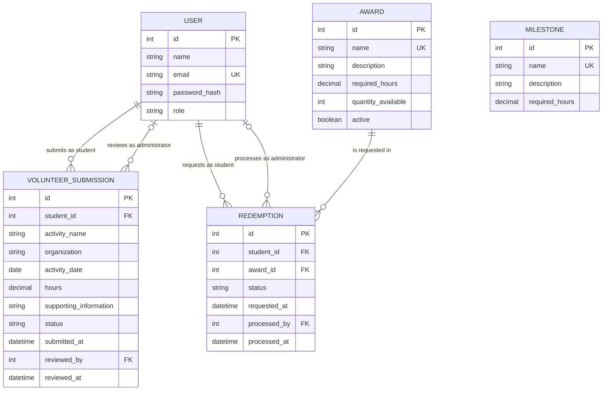

<!-- student-build:skill-integrity
status: pass
root: e84cd692d0b85eefe546385661958c27d07e8be6c5176a82012f68ccff5c8beb
expected_root: e84cd692d0b85eefe546385661958c27d07e8be6c5176a82012f68ccff5c8beb
mismatches: none
-->

# COMP 3613 Assignment 1

Draft this file with the Guide. **Update it after every phase milestone** before you pause. The use-case diagram is a UML PNG at `docs/diagrams/use-case.png`, linked from this file as `diagrams/use-case.png` (path relative to `docs/report.md`). The model diagram is Mermaid. **Embed wireframe images** as `wireframes/<file>` (files live in `docs/wireframes/`).

Do not put your student ID in this file if you will commit it. The PDF cover adds your name and ID at export time.

## Assigned project

Student Awards (incentive system)

## Three workflows

### 1. Submit Volunteer Hours (Student)

### 2. Track Progress and Milestones (Student)

### 3. Redeem Awards (Student)

## Use case diagram

Student (left) starts the three primary workflows as separate associations. Administrator (right) supports them with Review Submitted Hours, Manage Awards, and Process Redemption Requests — each a separate Administrator association, no «include» / «extend» to Submit or Redeem. Seeing which awards exist stays inside Redeem Awards. Deliberate gap: Manage milestone definitions is out of this MVP (Track Progress uses whatever milestones already exist).

## Model diagram

First draft. Update this section in Phase 5 when polish revises the model, and note what changed.

### Model rules and decisions

- `User.role` is either `student` or `administrator`. Name, unique email, and password hash are required.
- A student owns many volunteer submissions. An administrator may review many submissions; `reviewed_by` and `reviewed_at` remain null while a submission is pending.
- Volunteer submission status is `pending`, `approved`, or `rejected` and defaults to `pending`. Activity name and date are required, and hours must be greater than zero. Only an administrator may approve or reject a submission; doing so records the reviewer and review time.
- Only approved volunteer hours contribute to the student's verified total. Milestone unlocks and award eligibility are calculated from that total against their respective `required_hours`; neither `Milestone` nor `Award` needs a direct relationship to submissions.
- Milestone and award names are unique, their required-hour thresholds are positive, and descriptions are optional. Award inventory is nonnegative and `active` defaults to true.
- A redemption belongs to one student and one award. It starts as `pending` and may become `approved`, `rejected`, or `fulfilled`; only an administrator may approve or reject a pending request. Processing records the administrator and time.
- A student may request only an active award for which they have enough approved hours. Repeat redemption is allowed, but the same student cannot have more than one pending request for the same award.
- Creating a redemption does not reserve stock. Approval atomically reduces inventory by one and is forbidden when inventory is zero; an out-of-stock pending request is rejected when reviewed. Rejection does not change inventory, and an approved redemption may later be marked fulfilled when the prize is issued.

## Wireframes

### Submit Volunteer Hours

<!-- student-build:wireframe-coverage
use_case: Submit Volunteer Hours
image: docs/wireframes/log-volunteer-hours.png
covered: yes
-->

After submission, the page shows a success message and a **My Submissions** table below the form. The table shows activity, organization, activity date, hours, and the current `Pending`, `Approved`, or `Rejected` status. A new submission appears immediately as pending, and its status updates after administrator review.

### Track Progress and Milestones

<!-- student-build:wireframe-coverage
use_case: Track Progress and Milestones
image: docs/wireframes/progress-and-milestones.png
covered: yes
-->

Verified hours and leaderboard position are derived from approved volunteer submissions. Milestone completion is derived by comparing verified hours with each milestone threshold; no additional stored progress entity is required.

### Redeem Awards

<!-- student-build:wireframe-coverage
use_case: Redeem Awards
image: docs/wireframes/redeem-rewards.png
covered: yes
-->

Clicking **Redeem** shows a success confirmation and adds the request to a **My Redemptions** table on the same page. The table shows prize, requested date, and `Pending`, `Approved`, `Rejected`, or `Fulfilled` status. New requests start pending and reflect later administrator processing.

### Review Submitted Hours and Process Redemption Requests

<!-- student-build:wireframe-coverage
use_case: Review Submitted Hours
image: docs/wireframes/admin-approvals.png
covered: yes
-->

<!-- student-build:wireframe-coverage
use_case: Process Redemption Requests
image: docs/wireframes/admin-approvals.png
covered: yes
-->

For a pending volunteer submission, **Review** / **View Details** exposes student, activity, organization, activity date, hours, and supporting information before approval or rejection. The main table remains concise.

Pending redemptions show **Approve** and **Reject**. Approved redemptions remain visible and show **Mark as Fulfilled**; that action saves the fulfilled state and updates the student's history. Rejected and fulfilled rows have no further processing actions.

### Manage Awards

<!-- student-build:wireframe-coverage
use_case: Manage Awards
image: docs/wireframes/add-prize.png
covered: yes
-->

The Manage Awards page also includes a table of existing prizes with prize name, required hours, quantity, active status, and an edit action. Administrators can add a prize, edit its name, description, required hours, and quantity, adjust stock, and activate or deactivate it. Deletion is outside the MVP. The shown Add Prize form opens from this page.

### Phase 4 review

- Every use case in the use-case diagram is covered by a readable wireframe image; the shared administrator approvals image covers both review workflows.
- The initially unclear submission and redemption completion paths are resolved through student-visible history tables and status feedback.
- Administrator decisions now expose enough submission detail for informed review, and approved redemptions have a defined path to fulfillment.
- Manage Awards is broader than the pictured add form; its accepted table, edit, stock, and activation states should be implemented alongside that form in Phase 5. This is an incomplete-but-fixable screen detail, not a required redraw.
- The wireframes use **Prize/Reward** while the model uses `AWARD`. Treat these as UI labels for the same entity and choose one consistent product term during theming.
- No Phase 4 model revision is required: the accepted refinements use existing `status`, timestamp, `active`, and quantity fields. Leaderboard rank, verified hours, milestone progress, and eligibility remain derived values.

## Theming

- **Colors:** deep navy primary, teal secondary, off-white/light-gray background, green success, amber warning/pending, and red error/rejected states.
- **Type:** Inter with a system sans-serif fallback.
- **Tone:** professional, modern, simple, student-friendly, and minimal rather than overly corporate.
- **Wordmark:** text-only **Student Awards**; no custom MVP logo.
- **Applied:** shared CSS brand/status tokens, public landing page, login, registration, and authenticated application shell. FastStarter placeholder branding and demo copy were removed; authentication and `/config` were retained.
- **Theming verification:** registration, sign-in, and redirection worked correctly. After polish, the student confirmed that the landing page plus Student and Administrator authenticated views shared consistent branding, role-aware navigation was correct, authentication still worked, and no starter-template issues remained.
- **Polish after verification:** reduced the landing hero and decorative teal circle, removed the duplicate registration CTA, standardized visible terminology on **Award**, replaced the starter sidebar/menu treatment with a clean role-aware application header, and removed workflow placeholder copy.

## Implementation notes

One named workflow at a time. Include verify notes and polish / model revisions (Phase 5). Do not treat the first build as final.

### Submit Volunteer Hours — verified

- Implementation choice: one page with the submission form above the student's submission-history table.

<!-- student-build:code-check
workflow: Submit Volunteer Hours
form: choice
layer: other
architecture_ok: yes
implement_confidence: 0.85
passed: yes
note: Student selected a combined form-and-history page.
-->

<!-- student-build:code-check
workflow: Submit Volunteer Hours
form: snippet
layer: model
architecture_ok: yes
implement_confidence: 0.88
passed: yes
note: Student completed VolunteerSubmission fields, constraints, foreign keys, defaults, and nullable review metadata from the ERD.
-->

<!-- student-build:code-check
workflow: Submit Volunteer Hours
form: snippet
layer: router
architecture_ok: yes
implement_confidence: 0.91
passed: yes
note: Student completed a thin POST handler that binds form data and calls VolunteerSubmissionService with no persistence logic in the route.
-->

- **Verification:** the student confirmed the form matched the intended layout; required fields, success feedback, immediate history insertion, pending status, displayed activity data, and branding all worked correctly.
- **Polish:** volunteer-hour values were changed to hide insignificant trailing zeroes (`4.0000000000` → `4`, while preserving values such as `4.5`). Stored decimal precision was not changed.
- **Administrator review:** pending submissions are listed in the Administrator Approvals view. Expandable details expose student, activity, organization, activity date, hours, and supporting information before Approve or Reject. Review decisions update `status`, `reviewed_by`, and `reviewed_at`; the repository's verified-hours aggregate includes only `approved` submissions.
- **End-to-end verification:** two pending submissions appeared in Administrator Approvals with complete expandable details. The student approved one and rejected the other, then confirmed that both statuses updated correctly in the Student history and that whole/fractional hours rendered cleanly as `4` and `4.5`.

### Track Progress and Milestones — verified

- Implementation choice: leaderboard ties use dense ranking; equal verified-hour totals share a rank and the next distinct total receives the next consecutive rank.

<!-- student-build:code-check
workflow: Track Progress and Milestones
form: choice
layer: other
architecture_ok: yes
implement_confidence: 0.92
passed: yes
note: Student selected dense ranking for tied approved-hour totals.
-->

<!-- student-build:code-check
workflow: Track Progress and Milestones
form: snippet
layer: model
architecture_ok: yes
implement_confidence: 0.93
passed: yes
note: Student completed the Milestone model with a unique required name, optional description, and positive decimal threshold.
-->

<!-- student-build:code-check
workflow: Track Progress and Milestones
form: snippet
layer: router
architecture_ok: yes
implement_confidence: 0.95
passed: yes
note: Student completed a thin GET handler that calls ProgressService and renders its result without queries or ranking logic.
-->

- **Verification:** verified hours showed `4` from the approved submission only; the rejected `4.5` hours contributed nothing. Bronze, Silver, and Gold appeared in threshold order with correct `4 / 10`, `4 / 25`, and `4 / 50` progress. The current student appeared at rank `#1`, hours were cleanly formatted, and the page matched the approved branding. No further UI or workflow polish was requested.

### Redeem Awards — verified

- Implementation choice: selecting an eligible Award opens a confirmation modal before the pending redemption request is submitted.

<!-- student-build:code-check
workflow: Redeem Awards
form: choice
layer: other
architecture_ok: yes
implement_confidence: 0.95
passed: yes
note: Student selected a confirmation modal before redemption submission.
-->

<!-- student-build:code-check
workflow: Redeem Awards
form: snippet
layer: model
architecture_ok: yes
implement_confidence: 0.96
passed: yes
note: Student completed Award with its unique name, optional description, positive threshold, nonnegative inventory, and active default.
-->

<!-- student-build:code-check
workflow: Redeem Awards
form: snippet
layer: router
architecture_ok: yes
implement_confidence: 0.97
passed: yes
note: Student completed a thin POST handler that delegates redemption creation to AwardService and redirects without persistence or eligibility logic.
-->

- **Verification:** Awards showed correct thresholds and quantities; the Coffee Voucher was eligible at `4` verified hours while higher thresholds stayed locked. The confirmation modal created a pending request and duplicate pending requests were prevented. Administrator approval reduced quantity from `10` to `9`; requests could be rejected or marked fulfilled, and Student history reflected both statuses. Repeat requests became available after a request left pending status. Branding consistently used **Award**.

### Manage Awards — verified

- Implementation choice: Administrators edit existing Awards in a prefilled modal on the management page.
- The management screen lists Award name, description, required hours, quantity, and active state; it supports creating Awards, editing details, adjusting stock, and activating or deactivating an Award. Deletion remains outside the MVP.
- **Verification:** existing inventory displayed correctly; Add Award and prefilled Edit Award modals worked; name, description, required hours, and quantity saved correctly. Deactivation removed an Award from the Student catalogue and reactivation restored it. Nonpositive thresholds and negative quantities were rejected, with consistent styling and **Award** terminology.

### Cross-workflow dashboard polish — verified

- Student dashboard: verified hours, leaderboard rank, next-milestone progress, pending hour submissions, pending redemptions, and quick links to the three named workflows.
- Administrator dashboard: pending hour approvals, pending redemptions, active Award count, active Awards with quantity `3` or fewer, and quick links to Approvals and Awards.
- Dashboards are read-only landing summaries using existing workflow services/routes; they do not duplicate actions or introduce new workflows.
- **Final verification:** testing with both student accounts and the Administrator confirmed all submission and redemption states, approved-only hour totals, milestone and dense-rank updates, Award eligibility, duplicate-pending prevention, inventory decrement on approval, Award management and validation, accurate dashboards, consistent navigation/terminology/status styling/feedback/spacing, and correct empty and populated states.
- **Final model review:** no Phase 5 model revision was required. `Milestone` progress and leaderboard rank remain derived; redemption inventory changes occur on approval; dashboard values are read-only aggregates over the accepted entities.
- **Polish outcome:** no further UI, workflow, or model refinements were requested after the final cross-workflow pass.

## Deployed app

Phase 6. Public Render URL (not localhost). Markers open this to mark the three workflows.

https://faststarter-1ygs.onrender.com

The public health endpoint returns `{"ok":true}`.

## GitHub repository

https://github.com/Dar1ancpp/comp3613a1.git

## Logins

Every account a marker needs, including extra users you added. Starter accounts:

- `bob` / `bobpass` — `regular_user` (student)
- `admin` / `adminpass` — `admin` (administrator)

## YouTube video

https://youtu.be/ViRlo6-w-xI

## Final implementation summary

- Project: Student Awards, an incentive system for verified volunteer hours, milestone progress, and prize redemption.
- Named workflows: Submit Volunteer Hours, Track Progress and Milestones, Redeem Awards, plus administrator review and award management.
- Architecture: FastStarter routes remain thin; application rules live in services; persistence and queries live in repositories; SQLModel tables define the data model.
- Theme: deep navy, teal, off-white, status colors, Inter typography, and a consistent Student Awards wordmark across landing, authentication, and authenticated pages.
- Data lifecycle: volunteer submissions begin as `pending`; only approved submissions contribute to verified hours; milestones and award eligibility are derived from approved totals; redemption requests begin as `pending` and inventory changes occur only on approval.
- Admin workflows: review submissions, process redemptions, create and edit awards, adjust stock, and activate or deactivate awards.
- Verified polish: role-aware navigation, consistent Award terminology, clean hour formatting, confirmation flows, validation feedback, empty/populated states, and dashboard summaries for both student and administrator roles.

## Final deployment summary

- Render web service: `faststarter-1ygs.onrender.com`
- Database: Render Postgres configured for the web service; the database password and internal connection string are not included in the report.
- Health check: `GET /health` returned `{"ok":true}`.
- Deployment command used: `python manage.py init --no-drop && python manage.py run --host 0.0.0.0 --port $PORT`
- Render startup and configuration secrets were not committed; app usernames, passwords, and roles are listed above under Logins.

## Session transcripts

Filled when the Guide builds the report: the agent writes chat markdown into `docs/transcripts/`; `python manage.py report` packages them.

Guide packaged **7** chat(s) in `docs/transcripts/` (and `docs/transcripts.zip`).

Index: [docs/transcripts/INDEX.md](transcripts/INDEX.md)

- [`phase-1-project-and-workflows`](transcripts/phase-1-project-and-workflows.md)
- [`phase-2-use-case-diagram`](transcripts/phase-2-use-case-diagram.md)
- [`phase-3-model-diagram`](transcripts/phase-3-model-diagram.md)
- [`phase-4-wireframe-review`](transcripts/phase-4-wireframe-review.md)
- [`phase-5-theme-build-polish`](transcripts/phase-5-theme-build-polish.md)
- [`render-connected`](transcripts/render-connected.md)
- [`render-deploy-verification`](transcripts/render-deploy-verification.md)

## Competency (student-judge)

Filled by Guide from the student-judge run when this report was built.

**Judged at:** 2026-10-08T02:02:09.7070859-04:00  
**Evidence pass:** re-read all seven Phase 1-6 transcript files, current `docs/report.md`, UML/use-case artefacts, all five wireframes, shipped routers, and current skill-integrity result; prior `docs/judge.md` ignored  
**Student / session:** Student Awards project - complete COMP 3613 Guide record  
**Artifact:** Cursor/Codex Guide chats for Phases 1-5, GitHub Copilot Guide chats for Phase 6, and current project artefacts  
**Phases in evidence:** 1-6 (COMP 3613; Phase 5 theme/build/polish and Phase 6 deploy)

### Totals

| | Count / value |
|--|--|
| Metrics on rubric | 12 (M1-M12) |
| N/A (excluded) | 0 |
| Metrics scored | 12 |
| Scoreable max | 48 |
| Awarded total | 46 / 48 |
| **Overall (avg of scored)** | **3.8 / 4** |
| Impression mark | 19 / 20 |

## Scorecard

| ID | Metric | Score / 4 | In avg | Evidence |
|----|--------|----------:|:------:|----------|
| M1 | Phase discipline | 4 | yes | Design work stayed in separate Phase 1-4 chats, code began only after wireframe coverage, Phase 5 proceeded one workflow at a time with polish, and Phase 6 followed local verification. The student explicitly delayed the next slice: "Before we proceed to Track Progress and Milestones, I checked the Administrator account." |
| M2 | Problem framing | 4 | yes | The student selected Student Awards, named all three workflows in `Feature (user)` form, answered include/extend and shared-actor questions, supplied five entities with properties, defined lifecycle/inventory rules, and provided a complete branding direction. |
| M3 | Decision ownership | 4 | yes | Decisions remained student-owned across phases. Examples include keeping the three main workflows while adding Administrator support, selecting dense ranking, choosing a redemption confirmation modal, and revising `VolunteerSubmission` with `organization`. |
| M4 | Artefact-before-code | 3 | yes | The UML diagram, student-authored wireframes, ERD, and report were completed before implementation and were repeatedly used as the Phase 5 specification. The Guide performed most of the explicit artefact-to-code interpretation, so this is solid rather than exceptional student explanation. |
| M5 | Verification habit | 4 | yes | The student repeatedly ran and inspected the app, reported concrete observations, and requested polish. For example: "One polish issue remains" followed by the hours-format mismatch, then an end-to-end Administrator approval/rejection check. The report also records later award-management and cross-workflow verification. |
| M6 | Assignment fit | 4 | yes | Required SQLModel and thin-route checks passed for all three named workflows. Current routers contain no `select()`, `db.exec()`, `session.query`, `ilike`, or `or_` persistence patterns; rules remain in services and queries in repositories. Theme/build/polish preceded Render deployment. |
| M7 | Slice explanation | 3 | yes | The student gave strong own-words explanations of entities, relationships, validation rules, workflow completion paths, and UI mismatches, and completed every requested model/route snippet. The record contains less direct student explanation of why business rules belong in services and persistence in repositories. |
| M8 | Prompt quality | 4 | yes | Prompts were phase-tagged and increasingly precise. The Phase 5 polish request identified exact landing-page, terminology, navigation, role-awareness, and starter-template mismatches without asking for an unrelated rebuild. |
| M9 | Response to pushback | 4 | yes | The student consistently refined the design after questions and verification, including Administrator review details, redemption fulfillment, award management, formatting polish, and the dependency between approved submissions and progress. |
| M10 | Integrity | 4 | yes | No answer-seeking, prompt laundering, transcript gaming, or edited course skills were found. `python manage.py skills-verify` passes with all protected files matching the lock. |
| M11 | Provenance continuity | 4 | yes | The implementation grows directly from the student-named workflows, accepted ERD, wireframes, and later mismatch notes. No orphan or substitute product/schema appears. |
| M12 | Sincerity trajectory | 4 | yes | No suspicion protocol was needed. Student decisions, file-snippet attempts, verification observations, and polish requests remained consistent across the full Phase 1-6 record. |

## Strengths

- Strong ownership of problem framing: workflows, supporting actors, entities, relationships, lifecycle rules, and edge cases were supplied in the student's words.
- Excellent verification and polish habit: the student checked role-specific behavior, identified a formatting defect, completed Administrator review before progress, and reported observed state changes.
- Architecture-respecting implementation evidence: all three named workflows include passing SQLModel and thin-route checks, and the shipped routers preserve the required service/repository boundaries.
- High artefact continuity: the use-case diagram, ERD, wireframes, implementation choices, and deployed behavior remain aligned.
- Phase 6 is complete with a live Render service and successful health verification, without database credentials in the report or transcripts.

## Gaps (priority order)

1. No material phase-gate, architecture, verification, or integrity gap remains. The main opportunity is to make the student's layer reasoning more explicit in the transcript: briefly explain why one concrete rule belongs in the service and its query belongs in the repository, rather than relying mainly on successful snippet completion and Guide validation.

## Phase gate status

| Phase | Status | Note |
|-------|--------|------|
| 1 | met | Student selected Student Awards and named three workflows in the required format. |
| 2 | met | Include/extend, shared-actor, and missing-use-case questions were answered; the UML PNG covers Student and Administrator use cases. |
| 3 | met | Student named entities/properties, relationships, constraints, lifecycle rules, and the `organization` revision; the Mermaid ERD records them. |
| 4 | met | Five readable wireframes cover all six diagrammed use cases, and unclear submission/redemption/admin paths were resolved in the student's words. |
| 5 | met | Theme, all named workflows, required SQLModel/thin-route checks, student verification, and multiple polish passes are evidenced. |
| 6 | met | Render deployment is live, the public health endpoint was verified, and marker access is recorded in the report. |

## Recommended next practice

- For one existing workflow, write a three-part explanation naming the router's responsibility, the service rule it delegates, and the repository query that supports that rule. This would strengthen M7 from solid evidence to fully explicit architecture ownership.

## Integrity note

- Clean. No edited skills, failed integrity checks, laundering signals, or suspicious transcript discontinuities were found.

## Provenance flags

- None.

## Sincerity log summary

- Blocks found: 0 | max round: 0 | min/mean/final confidence: not applicable | trend: no suspicion | cleared: not needed

## Skips

- Skips: 0/3 used. Skips are not an integrity failure.

## Skill integrity

Course skills are hashed at export and compared to `.agents/skills.lock.json`. Do not edit `.agents/skills/`, `.cursor/skills/`, or `AGENTS.md`.

- Status: **pass**
- Root: `e84cd692d0b85eefe546385661958c27d07e8be6c5176a82012f68ccff5c8beb`
- none
