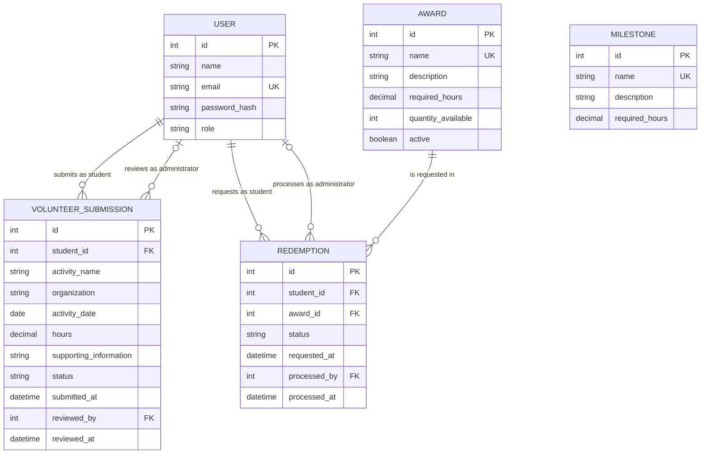

# COMP 3613 Assignment 1

Draft this file with the Guide. **Update it after every phase milestone** before you pause. The use-case diagram is a UML PNG at `docs/diagrams/use-case.png`, linked from this file as `diagrams/use-case.png` (path relative to `docs/report.md`). The model diagram is Mermaid. **Embed wireframe images** as `wireframes/<file>` (files live in `docs/wireframes/`).

Do not put your student ID in this file if you will commit it. The PDF cover adds your name and ID at export time.

## Assigned project

Student Awards (incentive system)

## Three workflows

### 1. Submit Volunteer Hours (Student)

### 2. Track Progress and Milestones (Student)

### 3. Redeem Awards (Student)

## Use case diagram


Student (left) starts the three primary workflows as separate associations. Administrator (right) supports them with Review Submitted Hours, Manage Awards, and Process Redemption Requests — each a separate Administrator association, no «include» / «extend» to Submit or Redeem. Seeing which awards exist stays inside Redeem Awards. Deliberate gap: Manage milestone definitions is out of this MVP (Track Progress uses whatever milestones already exist).

## Model diagram

First draft. Update this section in Phase 5 when polish revises the model, and note what changed.



### Model rules and decisions

- `User.role` is either `student` or `administrator`. Name, unique email, and password hash are required.
- A student owns many volunteer submissions. An administrator may review many submissions; `reviewed_by` and `reviewed_at` remain null while a submission is pending.
- Volunteer submission status is `pending`, `approved`, or `rejected` and defaults to `pending`. Activity name and date are required, and hours must be greater than zero. Only an administrator may approve or reject a submission; doing so records the reviewer and review time.
- Only approved volunteer hours contribute to the student's verified total. Milestone unlocks and award eligibility are calculated from that total against their respective `required_hours`; neither `Milestone` nor `Award` needs a direct relationship to submissions.
- Milestone and award names are unique, their required-hour thresholds are positive, and descriptions are optional. Award inventory is nonnegative and `active` defaults to true.
- A redemption belongs to one student and one award. It starts as `pending` and may become `approved`, `rejected`, or `fulfilled`; only an administrator may approve or reject a pending request. Processing records the administrator and time.
- A student may request only an active award for which they have enough approved hours. Repeat redemption is allowed, but the same student cannot have more than one pending request for the same award.
- Creating a redemption does not reserve stock. Approval atomically reduces inventory by one and is forbidden when inventory is zero; an out-of-stock pending request is rejected when reviewed. Rejection does not change inventory, and an approved redemption may later be marked fulfilled when the prize is issued.

## Wireframes

Embed each student-crafted wireframe here (Phase 4). Paths are relative to this file:

```markdown
### Explore / Search Publications


```

`python manage.py report` also embeds any PNG/JPG still missing from `docs/wireframes/`.

## Theming

Branding preferences and how they were applied (landing / login / register).

## Implementation notes

One named workflow at a time. Include verify notes and polish / model revisions (Phase 5). Do not treat the first build as final.

## Deployed app

Phase 6. Public Render URL (not localhost). Markers open this to mark the three workflows.

https://

## Logins

Every account a marker needs, including extra users you added. Starter accounts:

- bob / bobpass — regular user
- admin / adminpass — admin

## YouTube URL

## Session transcripts

Filled when the Guide builds the report: the agent writes each Guide chat to `docs/transcripts/<slug>.md` (Copilot Agent, Cursor, or OpenCode). `python manage.py report` packages them. Do not paste chats here during the build.

## Competency (student-judge)

Filled when the report is built. Guide runs student-judge, writes `docs/judge.md`, and export appends the scorecard here.

## Skill integrity

Filled by `python manage.py report`. Do not edit the course skills.
