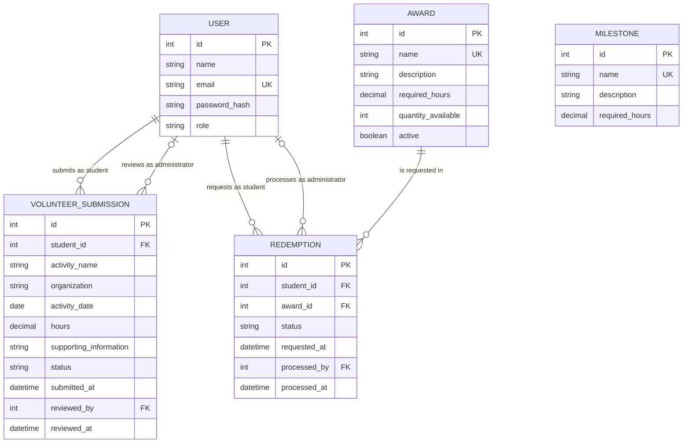

# COMP 3613 Assignment 1

Draft this file with the Guide. **Update it after every phase milestone** before you pause. The use-case diagram is a UML PNG at `docs/diagrams/use-case.png`, linked from this file as `diagrams/use-case.png` (path relative to `docs/report.md`). The model diagram is Mermaid. **Embed wireframe images** as `wireframes/<file>` (files live in `docs/wireframes/`).

Do not put your student ID in this file if you will commit it. The PDF cover adds your name and ID at export time.

## Assigned project

Student Awards (incentive system)

## Three workflows

### 1. Submit Volunteer Hours (Student)

### 2. Track Progress and Milestones (Student)

### 3. Redeem Awards (Student)

## Use case diagram

Student (left) starts the three primary workflows as separate associations. Administrator (right) supports them with Review Submitted Hours, Manage Awards, and Process Redemption Requests — each a separate Administrator association, no «include» / «extend» to Submit or Redeem. Seeing which awards exist stays inside Redeem Awards. Deliberate gap: Manage milestone definitions is out of this MVP (Track Progress uses whatever milestones already exist).

## Model diagram

First draft. Update this section in Phase 5 when polish revises the model, and note what changed.

### Model rules and decisions

- `User.role` is either `student` or `administrator`. Name, unique email, and password hash are required.
- A student owns many volunteer submissions. An administrator may review many submissions; `reviewed_by` and `reviewed_at` remain null while a submission is pending.
- Volunteer submission status is `pending`, `approved`, or `rejected` and defaults to `pending`. Activity name and date are required, and hours must be greater than zero. Only an administrator may approve or reject a submission; doing so records the reviewer and review time.
- Only approved volunteer hours contribute to the student's verified total. Milestone unlocks and award eligibility are calculated from that total against their respective `required_hours`; neither `Milestone` nor `Award` needs a direct relationship to submissions.
- Milestone and award names are unique, their required-hour thresholds are positive, and descriptions are optional. Award inventory is nonnegative and `active` defaults to true.
- A redemption belongs to one student and one award. It starts as `pending` and may become `approved`, `rejected`, or `fulfilled`; only an administrator may approve or reject a pending request. Processing records the administrator and time.
- A student may request only an active award for which they have enough approved hours. Repeat redemption is allowed, but the same student cannot have more than one pending request for the same award.
- Creating a redemption does not reserve stock. Approval atomically reduces inventory by one and is forbidden when inventory is zero; an out-of-stock pending request is rejected when reviewed. Rejection does not change inventory, and an approved redemption may later be marked fulfilled when the prize is issued.

## Wireframes

### Submit Volunteer Hours

<!-- student-build:wireframe-coverage
use_case: Submit Volunteer Hours
image: docs/wireframes/log-volunteer-hours.png
covered: yes
-->

After submission, the page shows a success message and a **My Submissions** table below the form. The table shows activity, organization, activity date, hours, and the current `Pending`, `Approved`, or `Rejected` status. A new submission appears immediately as pending, and its status updates after administrator review.

### Track Progress and Milestones

<!-- student-build:wireframe-coverage
use_case: Track Progress and Milestones
image: docs/wireframes/progress-and-milestones.png
covered: yes
-->

Verified hours and leaderboard position are derived from approved volunteer submissions. Milestone completion is derived by comparing verified hours with each milestone threshold; no additional stored progress entity is required.

### Redeem Awards

<!-- student-build:wireframe-coverage
use_case: Redeem Awards
image: docs/wireframes/redeem-rewards.png
covered: yes
-->

Clicking **Redeem** shows a success confirmation and adds the request to a **My Redemptions** table on the same page. The table shows prize, requested date, and `Pending`, `Approved`, `Rejected`, or `Fulfilled` status. New requests start pending and reflect later administrator processing.

### Review Submitted Hours and Process Redemption Requests

<!-- student-build:wireframe-coverage
use_case: Review Submitted Hours
image: docs/wireframes/admin-approvals.png
covered: yes
-->

<!-- student-build:wireframe-coverage
use_case: Process Redemption Requests
image: docs/wireframes/admin-approvals.png
covered: yes
-->

For a pending volunteer submission, **Review** / **View Details** exposes student, activity, organization, activity date, hours, and supporting information before approval or rejection. The main table remains concise.

Pending redemptions show **Approve** and **Reject**. Approved redemptions remain visible and show **Mark as Fulfilled**; that action saves the fulfilled state and updates the student's history. Rejected and fulfilled rows have no further processing actions.

### Manage Awards

<!-- student-build:wireframe-coverage
use_case: Manage Awards
image: docs/wireframes/add-prize.png
covered: yes
-->

The Manage Awards page also includes a table of existing prizes with prize name, required hours, quantity, active status, and an edit action. Administrators can add a prize, edit its name, description, required hours, and quantity, adjust stock, and activate or deactivate it. Deletion is outside the MVP. The shown Add Prize form opens from this page.

### Phase 4 review

- Every use case in the use-case diagram is covered by a readable wireframe image; the shared administrator approvals image covers both review workflows.
- The initially unclear submission and redemption completion paths are resolved through student-visible history tables and status feedback.
- Administrator decisions now expose enough submission detail for informed review, and approved redemptions have a defined path to fulfillment.
- Manage Awards is broader than the pictured add form; its accepted table, edit, stock, and activation states should be implemented alongside that form in Phase 5. This is an incomplete-but-fixable screen detail, not a required redraw.
- The wireframes use **Prize/Reward** while the model uses `AWARD`. Treat these as UI labels for the same entity and choose one consistent product term during theming.
- No Phase 4 model revision is required: the accepted refinements use existing `status`, timestamp, `active`, and quantity fields. Leaderboard rank, verified hours, milestone progress, and eligibility remain derived values.

## Theming

- **Colors:** deep navy primary, teal secondary, off-white/light-gray background, green success, amber warning/pending, and red error/rejected states.
- **Type:** Inter with a system sans-serif fallback.
- **Tone:** professional, modern, simple, student-friendly, and minimal rather than overly corporate.
- **Wordmark:** text-only **Student Awards**; no custom MVP logo.
- **Applied:** shared CSS brand/status tokens, public landing page, login, registration, and authenticated application shell. FastStarter placeholder branding and demo copy were removed; authentication and `/config` were retained.

## Implementation notes

One named workflow at a time. Include verify notes and polish / model revisions (Phase 5). Do not treat the first build as final.

## Deployed app

Phase 6. Public Render URL (not localhost). Markers open this to mark the three workflows.

https://

## Logins

Every account a marker needs, including extra users you added. Starter accounts:

- bob / bobpass — regular user
- admin / adminpass — admin

## YouTube URL

## Session transcripts

Filled when the Guide builds the report: the agent writes each Guide chat to `docs/transcripts/<slug>.md` (Copilot Agent, Cursor, or OpenCode). `python manage.py report` packages them. Do not paste chats here during the build.

## Competency (student-judge)

Filled when the report is built. Guide runs student-judge, writes `docs/judge.md`, and export appends the scorecard here.

## Skill integrity

Filled by `python manage.py report`. Do not edit the course skills.
